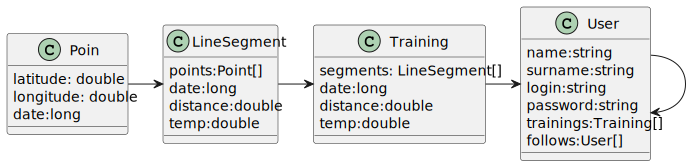

# Программирование мобильных устройств
## Выполнил студент группы ВПР43 Павлов А.А.

темой ВКР является мобильное приложение Дневник легкоатлета

# ТЗ

Программное средство должно осуществлять следующие функции:

*	регистрация пользователя;
*	вход на существующий аккаунт;
*	наличие пункта меню «профиль» с отображением истории тренировок;
*	поиск других пользователей;
*	отображение истории тренировок у других пользователей;
*	подписка на интересующих пользователей;
*	отображение в главном меню истории тренировок пользователей, на которых произведена подписка;
*	отображение анализа тренировки;

# UML диаграмма

