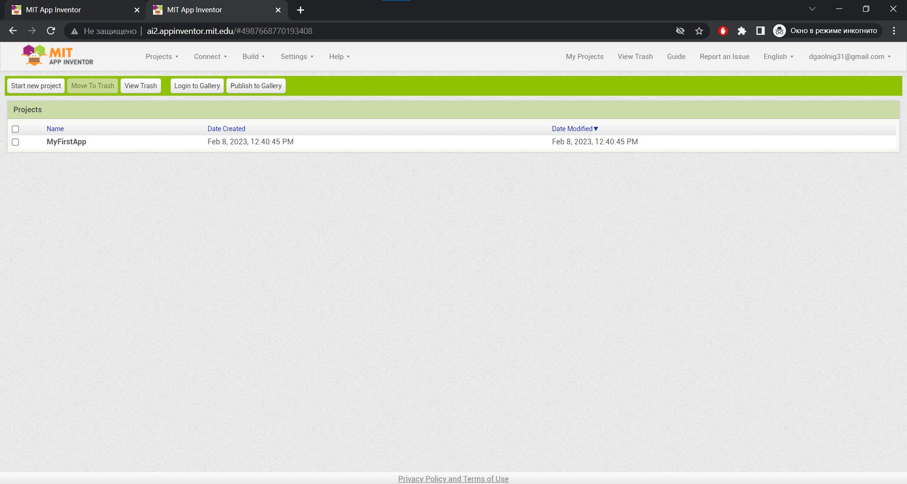
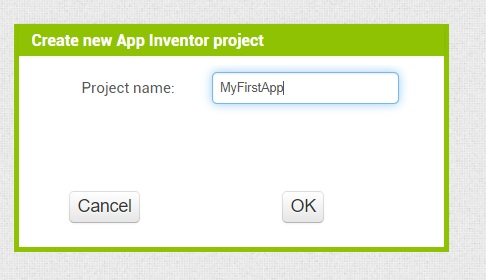
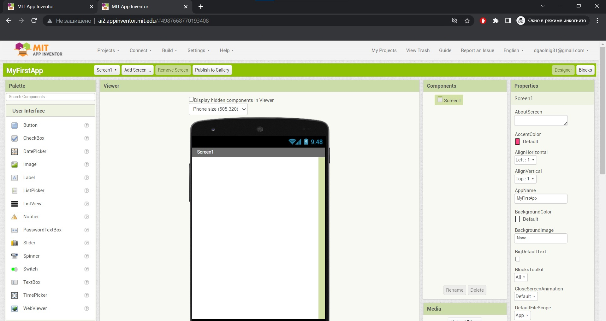
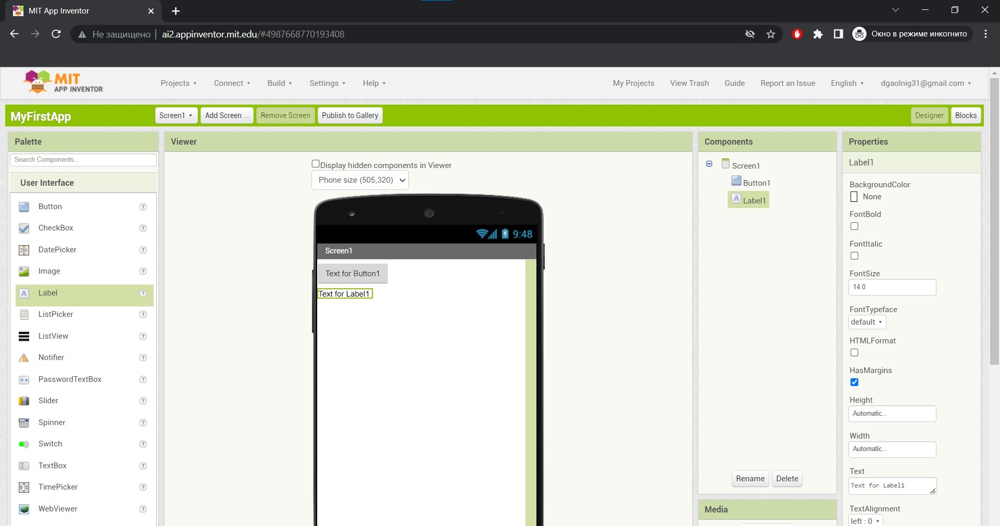
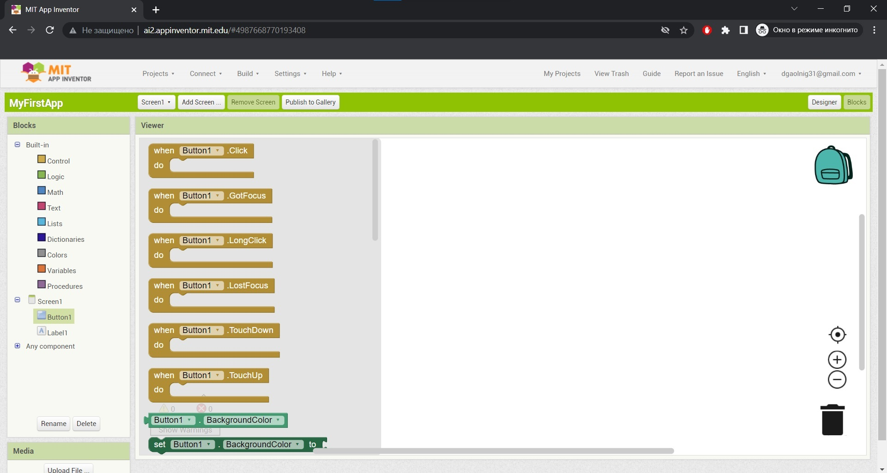
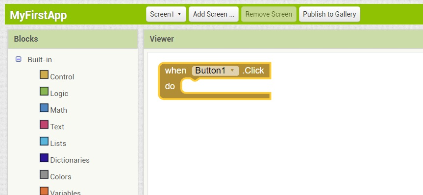
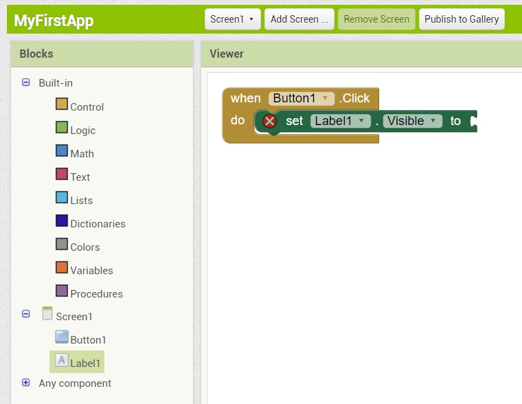
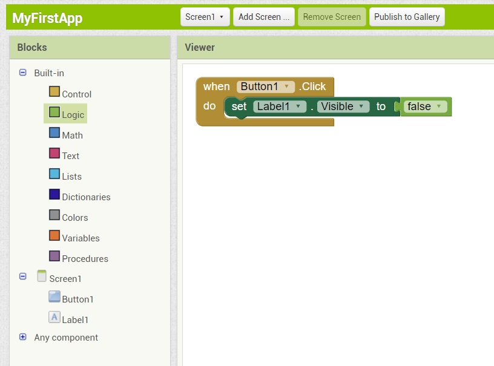

<br>
Рис. 15.3. Нажмкте кнопку Contlnue
<br>
Рис. 15.4. Список проектов
<br>
Рис. 15.5. Создание нового проекта
<br>
Рис. 15.6. Среда Арр lnventor<br>

Наконец, вы увидите саму среду (рис. 15.6), описание которой приводится в следующем разделе.

# 15.3. Основной экран Арр lnventor

Прежде чем приступить к созданию первого приложения, давайте исследуем меню
среды Арр Inventor (см. рис. 15.6).<br>

* В меmо Project сосредоточены основные команды управления проектом:
  * Му Projects - выводит список ваших проектов.
  * Start new project - создает новый проект.
  * Save project - сохраняет проект.
  * Save project as - сохраняет проект под другим именем.
* Меню Connect содержит команды подключения к устройству (USB) или к эмулятору (Emulator).
* В меню Build находятся команды построения проекта. Так, команда Арр (save
.apk to my computer) сохраняет АРК-файл созданного приложения на ваш компьютер. Далее вы можете запустить его в эмуляторе ( см. главу 2) или установить в своем смартфоне.<br>

Весь экран в режиме проектирования разделен на пять областей:<br>

* Palette - отображает палитру компонентов ( элементов графического интерфейса): кнопок, надписей, полей ввода и т. д.;
* Viewer - область предварительного просмотра и проектирования графического
интерфейса пользователя. Посмотрите на рис. 15.6- сейчас у нас там есть один экран: Screenl. Если вы добавите второй экран (с помощью кнопки Add Screen),
то кнопка для переключения на редактирование этого второго экрана появится
рядом с кнопкой Screenl. Переключатель Display hidden components in Viewer
позволяет отобразить в области Viewer невидимые компоненты;
* Components - отображает все компоненты, добавленные на экран. Даже если
компонент не отображается в области Viewer, он все равно будет присутствовать в области Components. На рис. 15.6 видно, что на первый экран (Screenl)
не добавлено компонентов (есть только Screenl);
* Media - эта область отображает медиафайлы;
* Properties - свойства выбранного компонента. Например, на рис. 15 .6 изображены свойства экрана Screenl. 

# 15.4. Проектирование приложения 

Добавьте в область Viewer два компонента: Button (кнопку) и Label (надпись),
чтобы компоненты в областях Viewer и Components отображались, как показано
на рис. 15.7. <br>
Затем щелкните на надписи и в области Properties очистите свойство Text - это
текст надписи. После этого надпись исчезнет из Viewer - точнее, она там останется, но так как вы очистили ее текст, она станет не видна. Чтобы вновь редактировать ее свойства, 'вам нужно будет щелкнуть на компоненте Labell в области
Components. <br>
Итак, вы научились изменять свойства компонента! Теперь опять выберите компонент Labell и присвойте свойству Text какой-нибудь текст, - например, нello !
Ведь по традиции первая программа должна содержать это слово! <br>

<br>
Рис:. 15.7. Добавление компоненты <br>

Что ж, полдела сделано- мы расположили компоненты на экране . Теперь присту
пим к описанию действий программы. Наша программа не будет слишком оригинальной - при запуске на экране будут видны кнопка и надпись. По нажатию на
кнопку надпись с экрана исчезнет. Пусть это и не самое сложное Аndrоidприложение, но как первый опыт - вполне сгодится.
Нажмите кнопку Blocks для открытия редактора блоков. Начнем собирать пазлы!
Сначала область редактора блоков будет пуста. Подумаем, что должно происходить? Мы же нажимаем на кнопку - следовательно, нам нужно действиеобработчик нажатия на кнопку.
Ваши компоненты отображаются в секции Screenl (или Screen2, Screen3- в зависимости от экрана). Выберите Buttonl - вы увидите все действия , доступные
для выбранного компонента, т. е. для кнопки (рис . 15.8).

<br>
Рис. 15.8. Редактор блоков<br>

Выберите пазл when Buttonl.Click do и добавьте его в свободную область редактора блоков (рис. 15.9). Поясню, что мы сделали, - выбрали обработчик нажатия
кнопки Buttonl. Теперь осталось определить, что произойдет, когда будет нажата
эта кнопка. Нам ведь надо скрыть надпись. Значит, первым делом в Screenl нужно
выбрать надпись Labell, чтобы посмотреть, что можно с ней сделать.
Выберите действие set Labell VisiЫe to. Это действие устанавливает свойство
VisiЫe надписи LaЬell в определенное значение. У вас должна получиться конструкция, показанная на рис. 15.10.
Чтобы скрыть надпись, нужно установить ее свойство VisiЫe в false. Вот и последний пазл нашей программы - из группы Built-in выбрать группу Logic, а из нее -
значение false. У вас должна получиться конструкция, показанная на рис. 15. 11.

<br>
Рис. 15.9. Соэдание обработчика для кнопки Button1<br>
<br>
Рис. 15.10. Определение действия для кнопки Button1<br>
<br>
Рис. 15.11. Сборка программы завершена<br>

Если нужно удалить какой-либо блок, просто перетащите его в корзину. По сути,
наша первая программа готова. Выберите команду меню Арр (save .apk to my
computer) из меню Build, а затем- каталог, в который нужно сохранить АРКфайл. Далее или протестируйте его в эмуляторе, или установите в смартфоне.
Напомню, что для тестирования программы в эмуляторе нужно открыть командную строку, перейти в каталог platform-tools и ввести команду:
```
аdb install пyть\MyFirstApp.apk
```
Как видите, создать программу с помощью Арр lnventor достаточно просто. Впрочем, скорее всего вы не будете использовать Арр Inventor при разработке реальных
проектов, поскольку ее возможности сильно ограничены. Зато среда отлично подойдет для обучения программированию - например, если у вас появится желание
научить своего ребенка создавать приложения для Android. 
